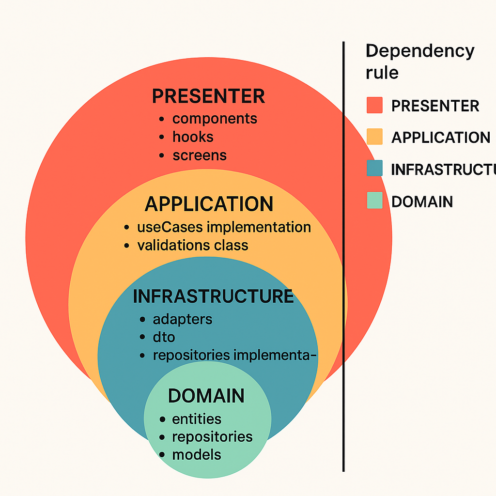

# 🚀 Zubale Technical Test

Create instagram clone.

https://662029f13bf790e070af2cd8.mockapi.io/api/v1

---

## 📑 Table of Contents

- [Introduction](#introduction)
- [Installation](#installation)
- [Usage](#usage)
  - [For development env in android](#for-development-env-in-android)
  - [For production env in android](#for-production-env-in-android)
  - [For development env in IOS](#for-development-env-in-ios)
  - [For production env in IOS](#for-production-env-in-ios)
- [Architecture](#architecture)
  - [Layers](#layers)
  - [Special Directories](#special-directories)
- [Key Highlights](#keyhighlights)
- [Areas for Improvement](#areasforimprovement)
- [Developer Contact](#-developer-contact)

---

### Introduction

For more details, check out the [Usage](#usage) section.
Welcome to **Zubale Technical Test**. This project is presented as a solution to the technical test for the React Native developer position at the company **Zubale**. Below is a detailed explanation of how to set up and run the project.

---

### Installation

To run the project, please follow the guidelines provided in the official [**React Native**](https://reactnative.dev) documentation for version [**0.80.0**](https://reactnative.dev/docs/environment-setup) It will be assumed that you have already completed this setup and verified that it works correctly.

The project has two development environments: **production** and **development**, each with its corresponding environment variables file. For the project to work properly, you must create two .env files in the root directory, as described below:

.env.development for the development environment with the following content:

```
ENVIRONMENT=development
API_URL=https://662029f13bf790e070af2cd8.mockapi.io/api/v1
```

.env.production for the production environment with the following content:

```
ENVIRONMENT=production
API_URL=https://662029f13bf790e070af2cd8.mockapi.io/api/v1
```

Next, you will need to install the project dependencies. The following versions of package managers and tools were used in this project:

- yarn: 3.6.4
- node: 20.8.0
- cocoapods or pod: 1.16.2
- ruby: ruby 2.7.6p219 [arm64-darwin22]

For convenience, it is recommended to use nvm for managing Node.js versions and rbenv for managing Ruby versions.

To maintain consistency in the environment configuration, Corepack was used and a local Yarn version was set up.

---

### Usage

As mentioned earlier, this project includes two development environments: production and development.
Environment separation was implemented using the [**react-native-dotenv**](https://www.npmjs.com/package/react-native-dotenv) library, which allows managing environment variables through `.env` files loaded at build time.

To run any development environment, open a terminal and execute the following command:

for development env

```bash
yarn start-development
```

for production env

```bash
yarn start-production
```

Next, in a separate terminal, you must run the command corresponding to the platform you want to compile. For example:

#### `android`

```bash
yarn android
```

#### `ios`

```bash
yarn ios
```

---

### Architecture

For this project, a **layered architecture** was used, based on **Clean Architecture** principles and **Domain-Driven Design (DDD)**. The structure consists of the following layers:

#### Layers

- **`domain`**
  This is the most important layer, containing the core business logic, as well as contracts for use cases and repositories for each module.

- **`application`**
  This layer holds the implementation of use cases for each module.

- **`infrastructure`**
  This layer contains the implementation of repositories, DTOs, and adapters.

- **`presenter`**
  This layer handles all UI-related concerns of the module. It includes framework-specific implementations such as:

  - Hooks
  - Components
  - Utilities
  - Screens



#### Special Directories

- **`core`**
  Contains configuration logic for libraries and application-wide handlers.

- **`shared`**
  Holds common UI-related elements such as:

  - Reusable components
  - Utilities
  - Custom hooks
  - Navigation logic
  - Theming system

---

### Key Highlights

The following points stand out in the implementation of the project:

- **Implementation multi-env**, allowing customized handling of each environment.
- **Implementation of Git flow** using `commitlint` for semantic commit verification, Git hooks with `husky` for executing scripts that check branch naming conventions and run tests on pre-push actions, and a script for the automatic generation of the pull request template.
- **Separation of project structure into layers** based on the principles of Domain-Driven Design (DDD) and Clean Architecture.
- **Implementation of the Presenter pattern** to separate business logic from UI representation.
- **Configuration of Jest** for running tests.
- **Implementation of the Repository pattern** for handling network requests.
- **Implementation of the Facade pattern** to abstract Axios and provide custom control over request execution.
- **Implementation of the Adapter pattern** to translate or change of one model to other.
- **Implementation of namespaces** for managing models.
- **Implementation of yarn with corepack** for manage consist of application setup.

---

### Areas for Improvement

The following aspects can be considered as points for improvement in the project implementation:

- Implementation of a test suite using **`react-native-testing-library`**, which is currently the recommended testing library according to the official documentation. An 80% code coverage can be considered acceptable, with a focus on testing business logic (use cases and infrastructure).
- Improvement of API requests using **`react-query`**, which provides an abstraction layer for request generation and enables caching of data.
- Implementation ci/cd flow with **`fastlane`** and github actions.

---

### 👤 Developer Contact

<table>
  <tr>
    <td style="vertical-align: middle; text-align: center;">
      
    </td>
    <td style="vertical-align: middle; padding-left: 20px;">
      <p>Nicolas Niño</p>
      <p>📧 <strong>Email:</strong> <a href="mailto:nicolasemilionino@hotmail.com">nicolasemilionino@hotmail.com</a></p>
      <p>🐱 <strong>GitHub:</strong> <a href="https://github.com/NicolasNinoViancha" target="_blank">nicolasNinoViancha</a></p>
      <p>💼 <strong>LinkedIn:</strong> <a href="www.linkedin.com/in/nicolas-emilio-nino-viancha-3169a61b0" target="_blank">nicolasNinoViancha</a></p>
    </td>
  </tr>
</table>
